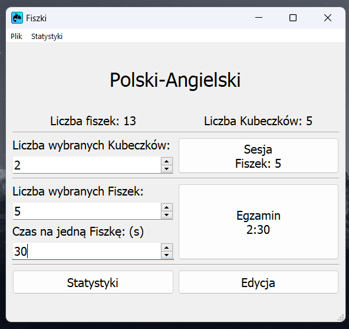
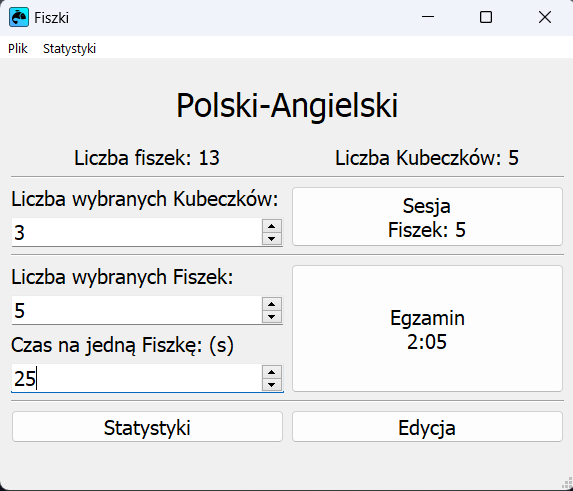
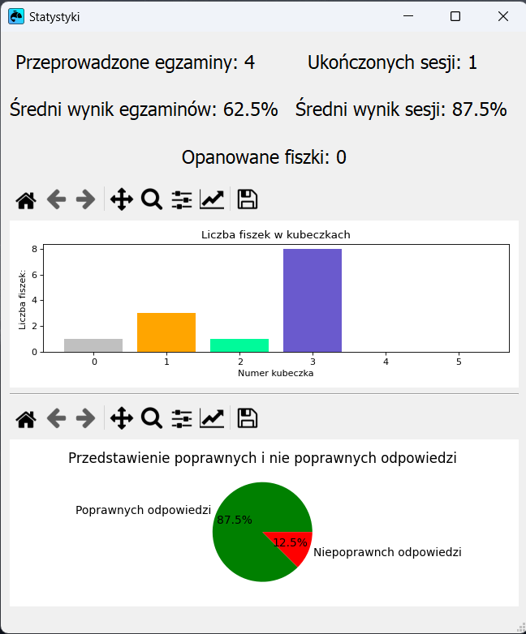
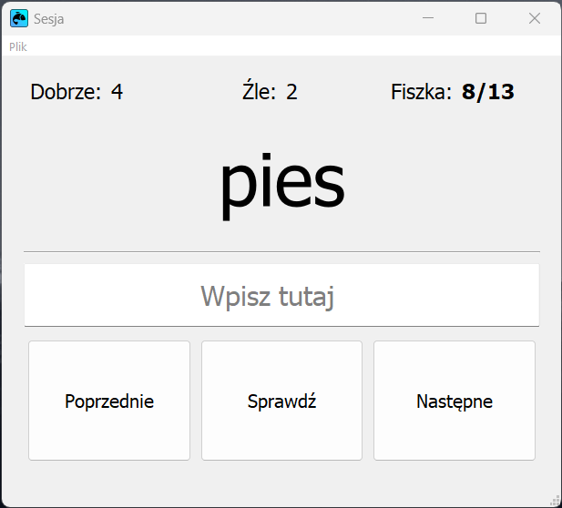
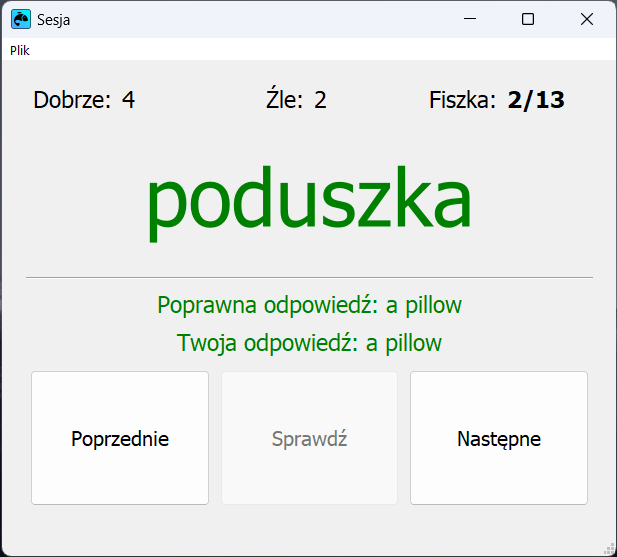
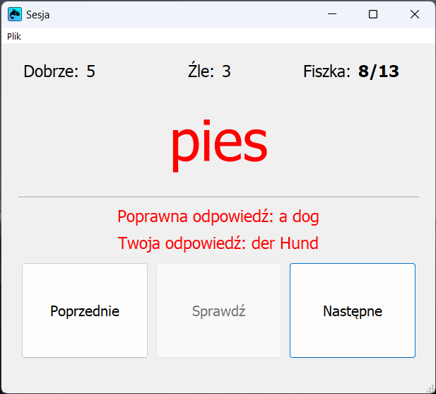

# Fishkey


## Wstęp.
Aplikacja Fishkey pozwala na naukę słówek w dowolnym języku z wykorzystaniem techniki [**Spaced Repetition Learning**.](https://en.wikipedia.org/wiki/Spaced_repetition)

## Zaimplementowane moduły:
### `main_launcher.py` 
Aplikacja startowa, pozwala na wybranie pliku z fiszkami, wyświetlanie statystyk korzystania z programu i wykonanych egzaminów oraz wybieranie liczby kubeczków lub liczby fiszek do egzaminu.
```console
$ python fishkey/main_launcher.py -i [plik_z_fiszkami]
```
### `session_launcher.py`
Pozwala na przeprowadzanie sesji na kubeczkach z przedziału [0, wybrana liczba]. Zapisuje efekty nauki.
```console
$ python fishkey/session_launcher.py -i plik_z_fiszkami -b {N} -l liczba_wybranych_kubeczków
```
### `exam_launcher.py`
Przeprowadza egzamin na wybranej liczbie fiszek. Zapisuje liczbę poprawnych i niepoprawnych odpowiedzi, nie modyfikuje kubeczka karty.
```console
$ python fishkey/exam_launcher.py -i plik_z_fiszkami -n liczba_wybranych_fiszek -t liczba_sekund_na_fiszkę
```
### `card_edit_launcher.py`
Moduł zezwalający na edycję parametrów fiszek 
```console
$ python fishkey/card_edit_launcher.py -i [plik_z_fiszkami]
```


## Mapa projektu:
- `/fishkey` - Główny katalog z kodem źródłowym
- `/tests` - Katalog zawierający testy
- `/docs` - Dokumentacja w Sphinx
- `/example_cards` - Katalog z przykładowymi plikami zawierającymi fiszki.
- `/qt_designs` - Katalog z plikami zapisu QtDesigner'a

## Konwencja nazewnictwa plików:
- `*_launcher.py` - Główne moduły projektu
- `*_ui.py` - Pliki wygenerowane przy pomocy narzędzia pyuic5
- `*_class.py` - Główne klasy `Card`, `Session`, `Exam`
- `*_methods.py` - Pliki zawierające metody, które nie powinny znajdować się wewnątrz obiektów.

## Działanie:

### **Sesja**
Wymaga podania wybranego przedziału kubeczków. Fiszki z wybranego przedziału wyświetlane są użytkownikowi do rozwiązania.
W przypadku poprawnej odpowiedzi fiszka trafia do następnego kubeczka lub ostatniego kubeczka.
Zła odpowiedź sprawia, że fiszka przenoszona zostaje do poprzedniego lub pierwszego kubeczka.
Jeśli fiszka została rozwiązana poprawnie [{N}](#n) razy "pod rząd" uznawana jest za "nauczoną" - trafia do ostatniego kubeczka.
Jeśli fiszka została rozwiązana niepoprawnie [{N}](#n) razy "pod rząd" uznawana jest za "zapomnianą" - trafia do pierwszego kubeczka.
Jeśli fiszka została rozwiązana poprawnie [{N}](#n) razy "pod rząd" uznawana jest za "nauczoną" - trafia do ostatniego kubeczka.
Jeśli fiszka została rozwiązana niepoprawnie [{N}](#n) razy "pod rząd" uznawana jest za "zapomnianą" - trafia do pierwszego kubeczka.

Obsługiwane skróty klawiszowe:

- `Enter` - Sprawdzenie aktualnej fiszki; jeśli fiszka jest już sprawdzona, przejście do następnej.
- `Ctrl + S` - Zapis aktualnego postępu sesji.
- `Strzałki kierunkowe` - Zmiana fiszki na poprzednią lub następną w przypadku gdy aktualnie wyświetlana fiszka jest uzupełniona.

Wyniki sesji zapisywane są do pliku z fiszkami w postaci zmienionych kubeczków oraz do pliku ze statystykami.

### **Egzamin**
Do działania wymaga podania liczby fiszek i czasu przeznaczonego na rozwiązanie jednej fiszki. Wybrana liczba fiszek jest losowana z uwzględnieniem priorytetu fiszki i wyświetlana użytkownikowi. (Wyższy priorytet skutkuje zwiększonym prawdopodobieństwem wylosowania fiszki.) Czas na rozwiązanie egzaminu to liczba fiszek * czas na rozwiązanie jednej fiszki. Po upływie czasu kończy się egzamin.
Wyniki egzaminu zapisywane są do pliku z fiszkami (Liczba poprawnych i niepoprawnych odpowiedzi karty jest edytowana) oraz do pliku ze statystykami. **Egzamin nie wpływa na liczbę poprawnych i niepoprawnych odpowiedzi *"pod rząd"***

Obsługiwane skróty klawiszowe:

- `Enter` - Sprawdzenie przejście do następnej fiszki.

### **Edycja**

Graficzne rozwiązanie edycji parametrów fiszki oraz tworzenie nowych fiszek.
Nowo zdefiniowane fiszki trafiają do pierwszego kubeczka.
Edytowalne parametry: główne słowo, słowo ukryte, liczbę poprawnych i niepoprawnych odpowiedzi, priorytet.

Obsługiwane skróty klawiszowe:

- `Ctrl + S` - Zapis aktualnego stanu zbioru fiszek.
- `Ctrl + O` - Otwarcie pliku z fiszkami.

### **Statystyki**
Wyświetlane zostaje okno ze statystykami wybranej listy fiszek oraz sesji i egzaminów wykonanych na tej liście.
Wyświetlane statystyki: Liczba przeprowadzonych egzaminów, liczba ukończonych sesji, średni wynik egzaminów, średni wynik sesji, liczba opanowanych fiszek, wykres przedstawiający liczbę fiszek w każdym kubeczku oraz wykres kołowy przedstawiający zestawienie poprawnych i niepoprawnych odpowiedzi wszystkich fiszek.


## Pliki zapisu:
Fiszki zapisywane są w pliku `.csv`. W formacie:

| Słowo odkryte 	| Słowo ukryte 	| Liczba poprawnych odpowiedzi 	| Liczba niepoprawnych odpowiedzi 	| Liczba poprawnych odpowiedzi pod rząd 	| Liczba niepoprawnych odpowiedzi pod rząd 	| Priorytet 	| Aktualny kubeczek 	|
|:-------------:	|:------------:	|:----------------------------:	|:-------------------------------:	|:-------------------------------------:	|:----------------------------------------:	|:---------:	|:-----------------:	|


Statystki sesji i egzaminów zapisywane są do pliku o nazwie identycznej do nazwy pliku z fiszkami z dopiskiem `_stats` o rozszerzeniu .json

## Konfiguracja:
Konfiguracja odbywa się poprzez edycję pliku `configuration.py`.
Parametry możliwe do zmiany. (Zmiana tylko raz, przed pierwszym uruchomieniem programu spowoduje uniknięcie błędów.)

#### Maksymalna liczba kubeczków.
Możliwość zmiany tego parametru nie została udostępniona użytkownikowi.

#### {N}
Liczba poprawnych, lub niepoprawnych odpowiedzi wymagana do uznania fiszki za "nauczoną" lub za "zapomnianą"

## Wygląd aplikacji:

| Główne okno | Okno edycji |  Okno statystyk |
|:-------------------:|:----------------------:|:-------------------------:|
|  |  | 

### Okno sesji.
| Brak odpowiedzi | Poprawna odpowiedź | Niepoprawna odpowiedź |
|:-------------------:|:----------------------:|:-------------------------:|
|  |  |  |

## Uwagi

- Projekt testowany był na Python'ie wersji **3.11**
Python w wersji < 3.10 będzie zwracał błędy. 

Autor: Paweł Skorupski
